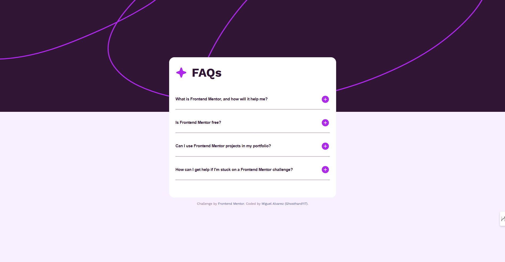

# Frontend Mentor - FAQ accordion

This is a solution to the [FAQ accordion challenge on Frontend Mentor](https://www.frontendmentor.io/challenges/faq-accordion-wyfFdeBwBz).

## Table of contents

- [Frontend Mentor - FAQ accordion](#frontend-mentor---faq-accordion)
  - [Table of contents](#table-of-contents)
  - [Overview](#overview)
    - [The challenge](#the-challenge)
    - [Screenshot](#screenshot)
    - [Links](#links)
  - [My process](#my-process)
    - [Built with](#built-with)
  - [Author](#author)

## Overview

### The challenge

Users should be able to:

- Hide/Show the answer to a question when the question is clicked
- Navigate the questions and hide/show answers using keyboard navigation alone
- View the optimal layout for the interface depending on their device's screen size
- See hover and focus states for all interactive elements on the page

### Screenshot

### Links

- Solution URL: [Add solution URL here](https://www.frontendmentor.io/solutions/faq-accordion-4osYMkXIT5)
- Live Site URL: [Add live site URL here](https://ghosthard117.github.io/faq-accordion/)

## My process

### Built with

- Semantic HTML5 markup
- CSS custom properties
- Flexbox
- CSS Grid

## Author

- Website - [Miguel Alvarez](https://ghostharddev.vercel.app/)
- Frontend Mentor - [@Ghosthard117](https://www.frontendmentor.io/profile/ghosthard117)
- LinkedIn - [@Ghosthard117](https://www.linkedin.com/in/ghosthard117/)
